# FuzzyStride
Smart Running Adviser is a fuzzy logic system developed as LAB - 3 in CSci 141 Intelligent Systems. It evaluates a runner’s training status using heart rate(bpm), pacing(min/km), and distance(km). This system helps to determine if they are undertraining, training normally, or overtraining that provides insightful feedback using Python’s Tkinter GUI.

## Requirements to Install
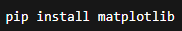
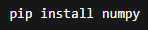
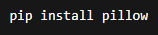
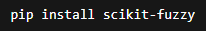
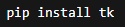

## Welcome Interface
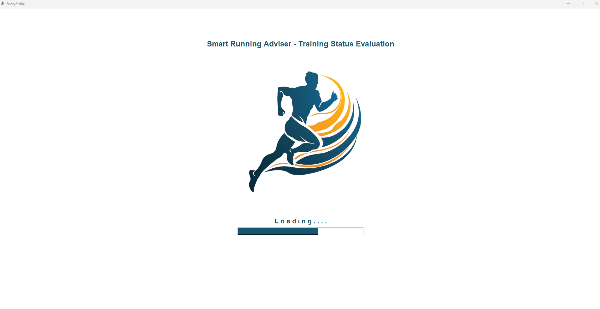

## Main Interface
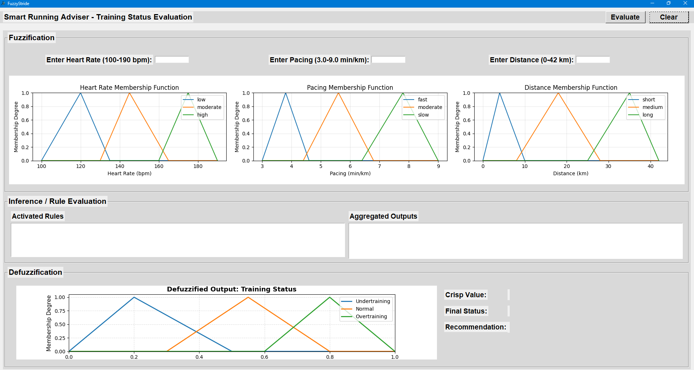

## Input

## Fuzzification
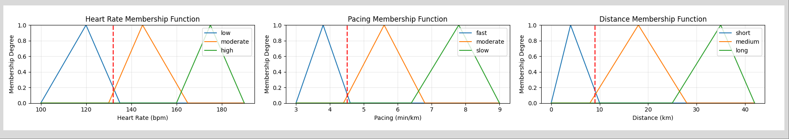

## Rules Evaluation
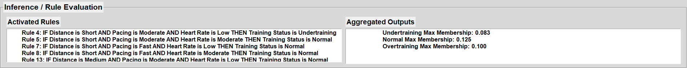

## Defuzzification
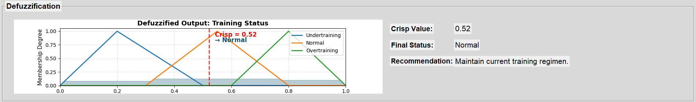

## Overview
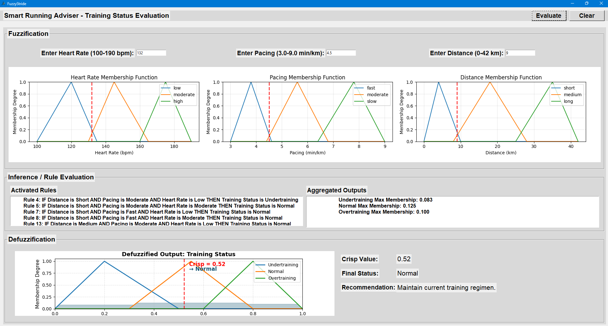
