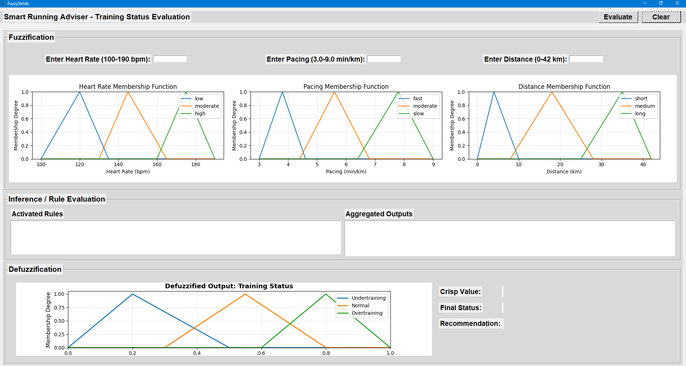
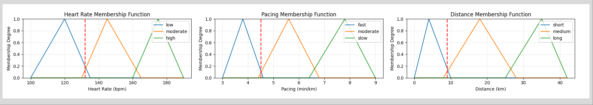
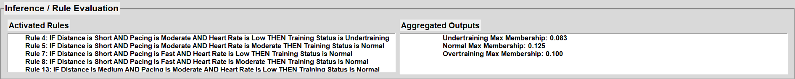
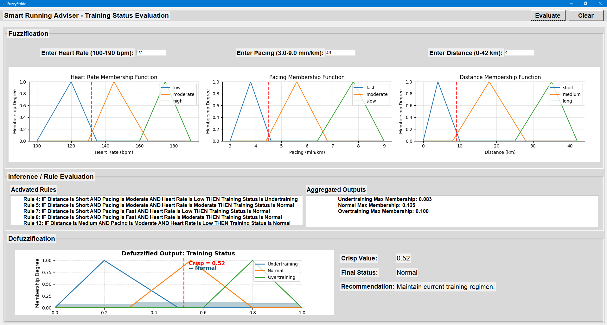

# FuzzyStride
Smart Running Adviser is a fuzzy logic system developed as LAB - 3 in CSci 141 Intelligent Systems. It evaluates a runner’s training status using heart rate(bpm), pacing(min/km), and distance(km). This system helps to determine if they are undertraining, training normally, or overtraining that provides insightful feedback using Python’s Tkinter GUI.

## Features
#### Welcome Interface

#### Main User Interface

#### Input

#### Fuzzification

#### Rules Evaluation

#### Defuzzification

#### Overview

## Requirements / Installations
* pip install matplotlib  
* pip install numpy  
* pip install pillow  
* pip install scikit-fuzzy  
* pip install tk  
